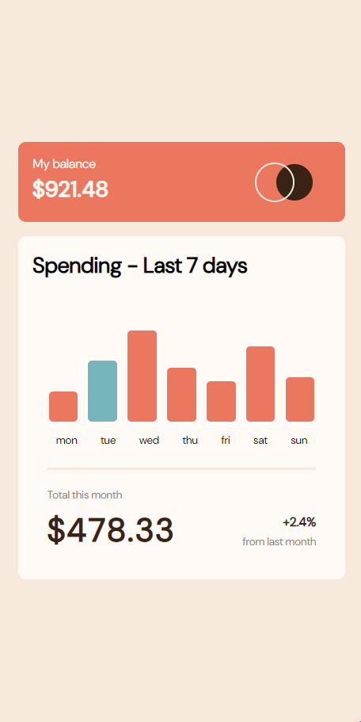

# Frontend Mentor - Expenses chart component solution

This is a solution to the [Expenses chart component challenge on Frontend Mentor](https://www.frontendmentor.io/challenges/expenses-chart-component-e7yJBUdjwt). Frontend Mentor challenges help you improve your coding skills by building realistic projects. 

## Table of contents

- [Overview](#overview)
  - [The challenge](#the-challenge)
  - [Screenshot](#screenshot)
  - [Links](#links)
- [My process](#my-process)
  - [Built with](#built-with)
  - [What I learned](#what-i-learned)
  - [Continued development](#continued-development)
  - [Useful resources](#useful-resources)
- [Author](#author)

## Overview

### The challenge

Users should be able to:

- View the bar chart and hover over the individual bars to see the correct amounts for each day
- See the current day’s bar highlighted in a different colour to the other bars
- View the optimal layout for the content depending on their device’s screen size
- See hover states for all interactive elements on the page
- **Bonus**: Use the JSON data file provided to dynamically size the bars on the chart 

### Screenshot

Desktop


Tablet


Mobile




### Links

- Solution URL: [Expense Chart Component]([https://your-solution-url.com](https://github.com/DominikSubocz/Expenses-chart-component)
- Live Site URL: [Expense Chart Component]([https://your-live-site-url.com](https://luxury-blancmange-04d1d3.netlify.app)

## My proces
My process is fairly straight forward, there's not much to go over. Firstly I look at the design, and adjust the .HTML file to my needs, I just structure it a little bit better. Next I style the items in CSS, to look
as closely to the solution as possible, this might take some time. Then I write a JS script if it's required, if not I just tweak bits in CSS, usually breakpoints, and fix them if they don't fit the window.

### Built with

- HTML5 
- SCSS
- Flexbox
- Mobile-first workflow
- JS

### What I learned

I learned how to load and parse a XML file in JS, as well as change names of individual divs to be names of days of the week in the right order! Here are some snippets of what I learned when making this project!

```JS
const jsonFilePath = 'data.json';


// Define currentDate as new Date
const currentDate =  new Date();
const currentDay = currentDate.toLocaleString('en-US', { weekday: 'short' }).toLowerCase(); // Gets day as "Mon", "Tue", etc.

fetch(jsonFilePath)
  .then(response => {
    if (!response.ok) {
      // Throw error here
    }
    // Parse the JSON response
  })
  .then(data => {
    console.log(data); // Display the data in the console as an example
    // Update div height function
    
    window.onresize = function(event) {
      // Update div height function
    }
  })
  .catch(error => {
    console.error('Error fetching JSON data:', error); // Display error.
  });
```
Okay I won't post more of my JS file cause I don't want to spoil the fun of making this website for anyone. This will surely be very useful in my future projects, as I'll be able to just copy paste it from this project to another.
Without having to bother with finding the right answer for long time.

### Continued development

There's nothing much to say that I could think of, perhaps I will focus on some JS and do simillar scripts, or do some challanges on edabit.

### Useful resources
These resources have nothing to do with this website, but I thought I'd post them anyway.

- [Icons8](https://icons8.com) - Very useful websites with illustrations, photos, icons and more.
- [GetWaves](https://getwaves.io) - Cool website where you can generate some vector waves and download them.

## Author

- Website - Dominik Subocz (I'm still making my own website)
- Frontend Mentor - [@DominikSubocz](https://www.frontendmentor.io/profile/DominikSubocz)

